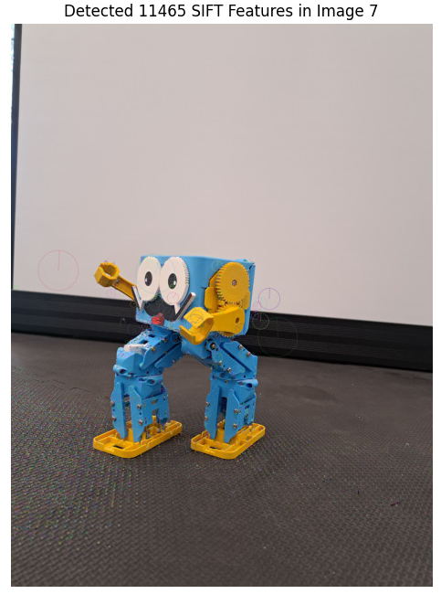
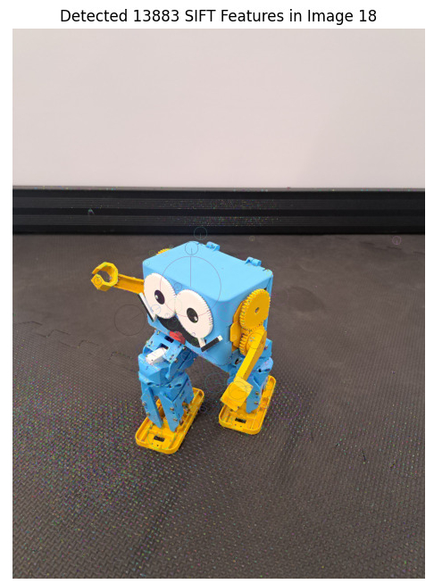
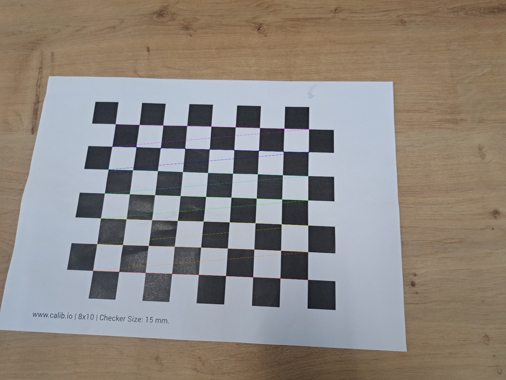
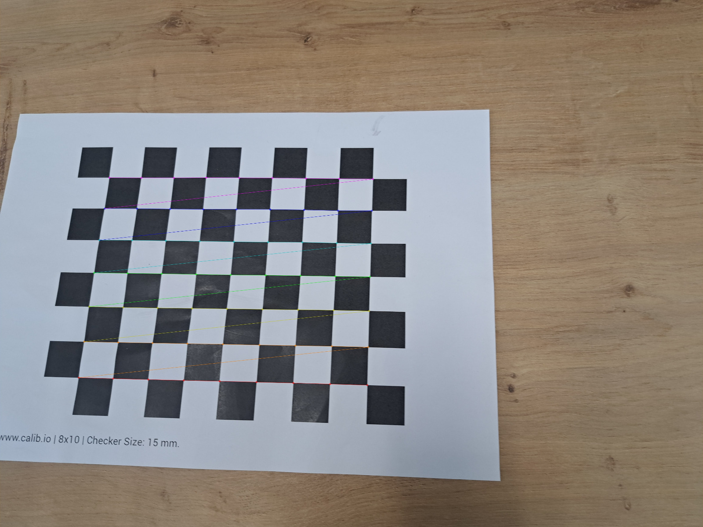

# Incremental Structure from Motion (SfM) Project

This repository implements an **Incremental Structure from Motion (SfM)** pipeline for 3D scene reconstruction from a dataset of 2D images. The pipeline extracts a sparse 3D point cloud and estimates camera poses by leveraging SIFT feature matching, epipolar geometry, triangulation, Perspective-n-Point (PnP) pose estimation, and bundle adjustment. The project explores both traditional optimization methods via SciPy and gradient-based optimization using PyTorch for bundle adjustment. The final reconstruction can be exported to the COLMAP format for visualization and further processing.

---

## Table of Contents
1.  [Introduction](#introduction)
2.  [Core Concepts and Theory](#core-concepts-and-theory)
    *   [Structure from Motion Overview](#structure-from-motion-overview)
    *   [Key Theoretical Components](#key-theoretical-components)
    *   [Mathematical Formulation: Bundle Adjustment](#mathematical-formulation-bundle-adjustment)
3.  [Methodology and Implementation](#methodology-and-implementation)
    *   [1. Dataset and Calibration](#1-dataset-and-calibration)
    *   [2. Feature Matching (`matching.py`)](#2-feature-matching-matchingpy)
    *   [3. Incremental Reconstruction (`reconstruction.py`)](#3-incremental-reconstruction-reconstructionpy)
        *   [Data Structures: `Point3DWithViews`](#data-structures-point3dwithviews)
        *   [Initial Pair Selection](#initial-pair-selection)
        *   [Initial Reconstruction](#initial-reconstruction)
        *   [Iterative Scene Growth](#iterative-scene-growth)
    *   [4. Bundle Adjustment (`bundle_adjustment.py`)](#4-bundle-adjustment-bundle_adjustmentpy)
        *   [Parameterization and Sparsity](#parameterization-and-sparsity)
        *   [SciPy-based BA (`do_BA`)](#scipy-based-ba-do_ba)
        *   [PyTorch-based BA (`do_BA_pytorch`)](#pytorch-based-ba-do_ba_pytorch)
    *   [5. Point Cloud Colorization & COLMAP Export](#5-point-cloud-colorization--colmap-export)
4.  [Results](#results)
5.  [Discussion](#discussion)
    *   [Strengths](#strengths)
    *   [Limitations](#limitations)
    *   [Future Improvements](#future-improvements)
6.  [How to Run the Code](#how-to-run-the-code)
    *   [Prerequisites](#prerequisites)
    *   [Directory Structure](#directory-structure)
    *   [Configuration (`main.py`)](#configuration-mainpy)
    *   [Running the Pipeline](#running-the-pipeline)
    *   [Output and Visualization](#output-and-visualization)
7.  [References](#references)

---

## Introduction

Structure from Motion (SfM) is a powerful photogrammetric technique used to reconstruct the 3D structure of a scene from a collection of 2D images taken from different viewpoints. The "incremental" approach, as implemented here, begins by reconstructing a sparse 3D model from an initial pair of images. This model is then progressively expanded by registering new images, triangulating new 3D points, and refining the entire reconstruction through a global optimization process called Bundle Adjustment.

This project processes a dataset of **N images** (configurable in `main.py`) and assumes a known camera calibration matrix $K$ (for custom datasets calibration code should be run). The core steps implemented are:
1.  Extracting SIFT features and matching them robustly across image pairs using Lowe's ratio test and RANSAC-based Fundamental matrix filtering.
2.  Selecting an optimal initial image pair and performing an initial 3D reconstruction via triangulation.
3.  Incrementally adding new views by estimating their poses using PnP and triangulating new 3D points.
4.  Globally optimizing all camera poses (represented by a 3x3 rotation matrix and a 3x1 translation vector) and 3D point locations via Bundle Adjustment to minimize reprojection errors. Both SciPy's `least_squares` and PyTorch's Adam/LBFGS optimizers are explored.
5.  Colorizing the final 3D point cloud based on image observations and exporting the reconstruction to the COLMAP format.

The final output includes the sparse 3D point cloud and the estimated camera poses (trajectory).

---

## Core Concepts and Theory

### Structure from Motion Overview
SfM estimates the 3D structure of a scene (a set of 3D points) and the motion (poses: rotation and translation) of the camera(s) that captured the input 2D images. It achieves this by finding and exploiting geometric relationships between corresponding points in multiple images.

-   **Feature Extraction and Matching**: Identifying salient keypoints and their descriptors in each image, then matching these keypoints across different images.
-   **Geometric Verification & Initial Reconstruction**: Using epipolar geometry (Fundamental/Essential matrix) to filter incorrect matches and estimate relative pose for an initial pair, followed by triangulation.
-   **Incremental Reconstruction**: Adding new cameras by estimating their pose (PnP) relative to existing 3D structure and triangulating new points.
-   **Bundle Adjustment (BA)**: Joint, non-linear optimization of all camera poses and 3D point coordinates to minimize reprojection error.

### Key Theoretical Components

1.  **SIFT (Scale-Invariant Feature Transform)**: A robust algorithm for detecting and describing local features in images, invariant to image scale, rotation, and partially to illumination changes and affine distortion.

<table align="center">
  <tr>
    <td align="center">
      
      <br><em>SIFT Features for image 4 in Middlebury dataset</em>
    </td>
    <td align="center">
      
      <br><em>SIFT Features for image 24 in Middlebury dataset</em>
    </td>
  </tr>
  <tr>
    <td align="center">
      
      <br><em>SIFT Features for image 7 in custom dataset</em>
    </td>
    <td align="center">
        
        <br><em>SIFT Features for image 18 in custom dataset</em>
    </td>
  </tr>
</table>

2.  **Lowe's Ratio Test**: A heuristic for reliable feature matching. If the ratio of the distance to the best match (d1) and the second-best match (d2) from a k-NN search (k=2) is below a threshold (e.g., d1/d2 < 0.75), the match is considered distinctive.

*Feature matching for Middlebury Dataset*
<table align="center">
  <tr>
    <td align="center">
      
      <br><em>Filtered Matches after Lowe's Ratio between image 0 & 41</em>
    </td>
  </tr>
  <tr>
    <td align="center">
      
      <br><em>Filtered Matches after Lowe's Ratio between image 2 & 3</em>
    </td>
  </tr>
</table>

*Feature matching for Custom Dataset*
<table align="center">
  <tr>
    <td align="center">
      
      <br><em>Filtered Matches after Lowe's Ratio between image 0 & 7</em>
    </td>
  </tr>
  <tr>
    <td align="center">
      
      <br><em>Filtered Matches after Lowe's Ratio between image 1 & 2</em>
    </td>
  </tr>
</table>

3.  **Fundamental Matrix ($F$) & Epipolar Geometry**:
    The fundamental matrix $F$ (3x3, rank 2) encodes the epipolar geometry: for corresponding points $\mathbf{x}, \mathbf{x'}$, $\mathbf{x'}^T F \mathbf{x} = 0$. It's estimated using RANSAC (e.g., 8-point algorithm) to filter outlier matches.

4.  **Epipolar Graph**: A graph where nodes are images. An edge exists if two images share sufficient geometrically verified matches. Edge weights can be the number of inliers [Fusiello, P131].

5.  **Triangulation**: Computing 3D point coordinates from 2D projections in two+ images with known poses. This project uses `cv2.triangulatePoints`. Stability depends on the baseline between cameras [Geiger, P33].


6.  **Perspective-n-Point (PnP)**: Estimating a calibrated camera's 6-DOF pose (R, T) from $n$ 3D-2D correspondences. This project uses `cv2.solvePnPRansac` with `cv2.SOLVEPNP_ITERATIVE`.

<div style="text-align: center;">
  
  <p><em>Caption: PnP Concept approximating exterior pose <i>R</i> and <i>T</i> of an about to get used image view for augmentation</em></p>
</div>

<div style="text-align: center;">
  
  <p><em>Caption: Compute angles between projection rays α, β, γ and then compute lengths of projection rays a ,b ,c</em></p>
</div>

<div style="text-align: center;">
  
  <p><em>Caption: Identify the correct solution for removing scale/depth ambiguity S1, S2, S3 by adding another correspondence pair</em></p>
</div>


7.  **Bundle Adjustment (BA)**: Non-linear optimization refining all camera poses and 3D points by minimizing reprojection errors.

### Mathematical Formulation: Bundle Adjustment

Bundle Adjustment (BA) is a non-linear least squares optimization procedure that simultaneously refines all 3D point coordinates $\{X_j\}$ and camera parameters (poses $\{R_i, T_i\}$, and optionally intrinsic parameters $K_i$) by minimizing the sum of squared reprojection errors. It is the gold standard for achieving high accuracy in SfM [Cremers P05, Fusiello P167].

The objective function to minimize is:

E({Rᵢ, Tᵢ} for i = 1 to m, {Xⱼ} for j = 1 to N) =  Σᵢ₌₁^m Σⱼ₌₁^N θᵢⱼ · ‖x̃ⱼᵢ − π(K, Rᵢ, Tᵢ, Xⱼ)‖²

Where:
-   $(\mathbf{R}_i, \mathbf{T}_i)$: Rotation (3x3 matrix) and translation (3x1 vector) defining the pose of camera $i$.
-   $\mathbf{K}$: The known intrinsic calibration matrix (assumed fixed for all cameras in this project).
-   $\mathbf{X}_j$: A 3D point $j$ in world coordinates.
-   $\tilde{\mathbf{x}}_{ji}$: The observed 2D projection of point $X_j$ in image $i$.
-   $\pi(\mathbf{K}, \mathbf{R}_i, \mathbf{T}_i, \mathbf{X}_j)$: The perspective projection function that maps the 3D point $\mathbf{X}_j$ onto the image plane of camera $i$. This is typically $\mathbf{P}_i \mathbf{X}_j = \mathbf{K}[\mathbf{R}_i | \mathbf{T}_i] \mathbf{X}_j$, followed by normalization.
-   $\theta_{ij}$: A binary visibility indicator (1 if point $j$ is observed in image $i$, 0 otherwise).
-   $\|\cdot\|^2$: The squared Euclidean norm.

This is a non-linear least squares (NLS) problem. To solve it using iterative methods like Gauss-Newton or Levenberg-Marquardt, we need the Jacobian matrix of the residuals with respect to the parameters. The parameters consist of camera pose parameters and 3D point coordinates.

**Parameterization:**
-   **Camera Poses**: Each camera $i$ contributes pose parameters. In this project, the pose $(\mathbf{R}_i, \mathbf{T}_i)$ is often parameterized as a 12-element vector (e.g., 9 elements for the flattened rotation matrix and 3 for the translation vector).
-   **3D Points**: Each 3D point $\mathbf{X}_j$ contributes 3 parameters $(X, Y, Z)$.

**The Jacobian Matrix ($J$):**
The Jacobian relates changes in parameters to changes in reprojection errors. It has a characteristic sparse block structure. For a single observation of point $j$ in image $i$, the residual is rⱼᵢ = x̃ⱼᵢ − π(K, Rᵢ, Tᵢ, Xⱼ). The Jacobian contains partial derivatives of these residuals:

-   **Derivatives w.r.t. Camera $k$'s Pose Parameters ($\mathbf{g}_k$):**
    Let Aᵢⱼₖ denotes the block ∂rⱼᵢ / ∂gₖᵀ. This block is non-zero only if $i=k$ (i.e., the parameters of camera $i$ affect only the observations made by camera $i$): Aᵢⱼₖ = ∂[η̃(Pᵢ · Mʲ)] / ∂gₖᵀ
    (where $P_i$ is camera $i$'s projection matrix, $M^j$ is 3D point $j$, and $\tilde{\eta}$ encapsulates the projection error).

-   **Derivatives w.r.t. 3D Point $k$'s Coordinates ($\tilde{\mathbf{M}}_k$):**
    Let $\mathbf{B}_{ijk}$ denote the block Bᵢⱼₖ. This block is non-zero only if $j=k$ (i.e., the coordinates of point $j$ affect only the observations of point $j$): Bᵢⱼₖ = ∂[η̃(Pᵢ · Mʲ)] / ∂M̃ₖᵀ

**Sparsity Exploitation:**
The conditions Aᵢⱼₖ = 0 for all $i \ne k$ and Bᵢⱼₖ = 0 for all $j \ne k$ mean that each row of the Jacobian (corresponding to a single 2D observation's x and y residuals) has non-zero entries only for the parameters of the specific camera that made the observation and the specific 3D point that was observed. This results in a highly sparse "arrowhead" or "bordered block diagonal" structure for the normal equations matrix $J^T J$.

The Jacobian matrix structure :
J = [
<br>  A₁₁₁       | B₁₁₁
<br>  A₁₂₁       |     B₁₂₂
<br>  ⋮          |         ⋱
<br>  A₁ₙ₁₁      |             B₁ₙ₁N
<br>     A₂₁₂    | B₂₁₁
<br>     A₂₂₂    |     B₂₂₂
<br>     ⋮       |         ⋱
<br>     A₂ₙ₂₂   |             B₂ₙ₂N
<br>⋯   ⋯   ⋱     | ⋯   ⋯   ⋱   ⋯
<br>        Aₘ₁ₘ | Bₘ₁₁
<br>        Aₘ₂ₘ |     Bₘ₂₂
<br>        ⋮    |         ⋱
<br>        Aₘₙₘₘ |             BₘₙₘN
]

*This matrix representation is conceptual. Each A and B block corresponds to the derivatives of one observation's 2D residual vector with respect to one camera's parameters or one point's parameters.*

### Solving Bundle Adjustment: Optimization Algorithms

Solving the BA NLS problem typically involves iterative methods. This project explores two main families:

**1. Gauss-Newton:**
The Gauss-Newton algorithm is an iterative method to solve NLS problems. It approximates the non-linear residual function locally with a linear one at each step.
Given the current estimate of parameters $\mathbf{p}_t$:
1.  **Linearize Residuals**: r(p_t + δp) ≈ r(p_t) + J(p_t) · δp, where J(p_t) is the Jacobian.
2.  **Solve Linear System (Normal Equations)**: Find the update step $\delta \mathbf{p}$ that minimizes the linearized sum of squares ‖r(p_t) + J(p_t) · δp‖². This leads to solving:
    δp = - (J(p_t)ᵀ J(p_t))⁻¹ J(p_t)ᵀ r(p_t)
    The term $J^T J$ is an approximation of the Hessian matrix and is positive semi-definite.
3.  **Update Parameters**: p_{t+1} = p_t + δp
4.  **Iterate** until convergence.

*   **Implementation (`do_BA`)**: The `scipy.optimize.least_squares` function with the `'trf'` (Trust Region Reflective) method is used. TRF is a sophisticated algorithm well-suited for large, sparse NLS problems and shares principles with Gauss-Newton/LM. It implicitly handles the construction and solution of these linear systems, leveraging the provided sparse Jacobian.

**2. First-Order Gradient Descent Methods:**
These methods use only the first derivative (gradient) of the loss function L(p) = Σ ‖r_k(p)‖².
The basic update rule is:
p_{t+1} = p_t - α ∇L(p_t)
where $\alpha$ is the learning rate.

*   **Adam (Adaptive Moment Estimation)**:
    An advanced variant that computes adaptive learning rates for each parameter. It does so by keeping track of an exponentially decaying average of past gradients (first moment) and past squared gradients (second moment).
    Let gₜ = ∇L(pₜ) be the gradient at timestep $t$. The update rules for Adam are (simplified, element-wise operations):

    1.  **Update biased first moment estimate:**
        mₜ = β₁ mₜ₋₁ + (1 - β₁) gₜ
    2.  **Update biased second moment estimate:**
        vₜ = β₂ vₜ₋₁ + (1 - β₂) gₜ²
        (where gₜ² is the element-wise square gₜ ⊙ gₜ)
    4.  **Compute bias-corrected first moment estimate:**
        m̂_t = m_t / (1 - β₁ᵗ)
    5.  **Compute bias-corrected second moment estimate:**
        $$ \hat{\mathbf{v}}_t = \frac{\mathbf{v}_t}{1 - \beta_2^t} $$
    6.  **Update parameters:**
        v̂_t = v_t / (1 - β₂ᵗ)

    Where:
    -   $\alpha$: The learning rate (step size).
    -   $\beta_1, \beta_2$: Exponential decay rates for the moment estimates (typically close to 1, e.g., $\beta_1 = 0.9, \beta_2 = 0.999$).
    -   $\epsilon$: A small constant for numerical stability (e.g., $10^{-8}$).
    -   $\beta_1^t, \beta_2^t$: $\beta_1$ and $\beta_2$ raised to the power of $t$.
    *   This approach is flexible and can easily leverage GPU acceleration. A critical step when parameterizing rotation matrices directly (e.g., as 9 elements) is to re-orthogonalize them after optimization steps to ensure they remain valid rotation matrices.

Both families of methods aim to find the parameters $\mathbf{p}$ that minimize the sum of squared reprojection errors, but they differ in how they compute the update step $\delta \mathbf{p}$ and their convergence properties. Second-order methods like Gauss-Newton/LM often converge faster (in fewer iterations) when close to the minimum but require computation or approximation of second-order information (via $J^TJ$). First-order methods are simpler per iteration but may require more iterations and careful tuning of learning rates, but thanks to Pytorch the gradient method is 4X faster because of using GPU Parllelization.

---
---

## Methodology and Implementation

The SfM pipeline is orchestrated by `main.py`, calling modules for matching, reconstruction, and bundle adjustment.

### 1. Dataset and Calibration
-   **Dataset Loading**: Images are loaded in grayscale for feature processing and in color for plotting/colorization using `utils.get_images`. The number of images (`n_imgs`) and dataset name (`imgset`) are configured in `main.py`.
-   **Camera Calibration Matrix ($K$)**: A single, known 3x3 intrinsic matrix $K$ is used for all images, defined in `main.py`.
    K = [
  <br>[fₓ  0   cₓ]
  <br>[0   fᵧ  cᵧ]
  <br>[0   0    1 ]
]
### 2. Feature Matching (`matching.py`)
The `SIFTMatcher` class handles 2D-2D correspondences:
1.  **Feature Extraction (`extract_features`)**: `cv2.SIFT_create()` detects keypoints and computes descriptors for all grayscale images.
2.  **All-to-All Raw Matching (`match_all_pairs`)**: `cv2.BFMatcher(cv2.NORM_L1)` with `knnMatch` (k=2) finds potential matches between all unique image pairs. Lowe's ratio test (configurable `ratio_threshold`) filters these raw matches.
3.  **Outlier Filtering (`filter_outliers`)**: For each pair with sufficient raw matches, `cv2.findFundamentalMat` with `cv2.FM_RANSAC` (configurable `ransac_threshold`) estimates the Fundamental matrix. Matches not consistent with this model (outliers) are discarded, matches satisfying $\text{rank}(F) = 2$ are retained, keeping in mind matches having at least `min_matches` inliers.
4.  **Connectivity Graph (`connectivity`)**: An adjacency matrix (`img_adjacency`) and a list of connected image pairs are generated based on pairs having valid matches.

### 3. Incremental Reconstruction (`reconstruction.py`)
The `ReconstructionPipeline` class manages the progressive scene building:

#### Data Structures: `Point3DWithViews`
This class is crucial for tracking each 3D point:
-   `point3d (np.ndarray)`: The (3,) array of 3D coordinates.
-   `source_2dpt_idxs (Dict[int, int])`: A dictionary mapping an image index to the original index of the 2D keypoint in that image which corresponds to this 3D point. This tracks which 2D features observe which 3D point.

#### Initial Pair Selection (`best_img_pair`)
1.  Identifies image pairs from the adjacency graph that exceed a certain percentile (`top_x_perc`) of match counts.
2.  Among these, it selects the pair that, after estimating the Essential Matrix and recovering pose (`cv2.recoverPose`), exhibits the largest rotation angle (sum of absolute Rodrigues vector components) while ensuring all matched points are successfully processed by `recoverPose`. This heuristic aims for a good baseline and well-distributed features, to insure stability of triangulation [Geiger, P33].

#### Initial Reconstruction (`initialize_reconstruction`)
1.  For the `best_pair` (img_idx1, img_idx2):
    -   Keypoints are aligned using `get_aligned_kpts`.
    -   The Essential Matrix `E` is computed, and `cv2.recoverPose` yields the relative rotation `R1` and translation `t1` of img_idx2 w.r.t. img_idx1 (which is set to identity pose: `R0=I, t0=0`).
    -   Initial 3D points are created by calling `triangulate_points_and_reproject`, populating a list of `Point3DWithViews` objects. At this stage, reprojection error computation is initially skipped.

#### Iterative Scene Growth
The main loop in `main.py` drives this, using `ReconstructionPipeline` methods:
1.  **Next Image Selection (`next_img_pair_to_grow_reconstruction`)**:
    -   A heuristic determines the next unresected image to add. It tries to "fill in" images between the initial pair first, then extend outwards. The logic handles cases where the initial pair might "straddle" the end of a circular sequence. It returns a `resected_idx` (already in the model) and an `unresected_idx` to be added, in preperation for PnP [Fusiello, P133].
2.  **Finding 2D-3D Correspondences (`get_correspondences_for_pnp`)**:
    -   For the chosen `resected_idx` and `unresected_idx`:
        -   It iterates through existing `points3d_with_views`. If a 3D point is seen by `resected_idx`, it checks for a match of that 2D feature (from `resected_idx`) to a feature in `unresected_idx`.
        -   If found, this forms a 2D (in `unresected_idx`) to 3D correspondence for PnP. The `source_2dpt_idxs` of the `Point3DWithViews` object is updated.
        -   Matches between `resected_idx` and `unresected_idx` that *don't* correspond to existing 3D points are marked for future triangulation (via `triangulation_status`), resulting in augmenting the point cloud.
3.  **Pose Estimation (`do_pnp`)**:
    -   `cv2.solvePnPRansac` (using `cv2.SOLVEPNP_ITERATIVE`) estimates the pose (`R_new`, `t_new`) of `unresected_idx` using the prepared 2D-3D correspondences.
    -   A minimum number of correspondences (e.g., 12 in `main.py`, though PnP itself needs fewer, exactly 3 but to diambiguate we need a 4th correspondence) is required. If PnP fails or has too few inliers, the image might be skipped.
4.  **New Point Triangulation**:
    -   Using the newly estimated pose (`R_new`, `t_new`) of `unresected_idx` and the known pose of `resected_idx`, new 3D points are triangulated from the matches marked by `triangulation_status`. `triangulate_points_and_reproject` is called again, this time computing reprojection errors for these new points.
5.  **Bundle Adjustment Trigger**: BA is triggered based on conditions like PnP inlier percentage, reprojection errors of newly triangulated points, or after a certain number of images are added (using `BA_chkpts` in `main.py`).

### 4. Bundle Adjustment (`bundle_adjustment.py`)
This module contains functions for the NLS optimization.

#### Parameterization and Sparsity
-   **Camera Parameters**: Each camera pose is represented by 12 parameters: 9 for the flattened 3x3 rotation matrix and 3 for the translation vector.
-   **3D Points**: Each point has 3 parameters (X, Y, Z).
-   **Sparsity Matrix (`create_bundle_adjustment_sparsity`)**: A `scipy.sparse.lil_matrix` is constructed to define the Jacobian's sparsity pattern. For each 2D observation $(x, y)$, the Jacobian rows corresponding to this observation will have non-zero entries only for the 12 parameters of the observing camera and the 3 parameters of the observed 3D point.

#### SciPy-based BA (`do_BA`)
1.  **Data Preparation**:
    -   Active camera poses (`R_mats`, `t_vecs`) and 3D points (`points3d_with_views`) are gathered.
    -   Original image indices are mapped to dense (0 to N-1) indices for the BA problem.
    -   An initial 1D parameter vector `initial_params` is formed by concatenating all flattened camera parameters and all 3D point coordinates.
    -   Observation data (`camera_indices`, `point_indices` for each 2D point, and `points_2d` observations) are prepared.
2.  **Optimization**:
    -   `scipy.optimize.least_squares` is called with:
        -   `calculate_reprojection_error` as the residual function. This function unpacks `params`, projects relevant 3D points using `project_points` (which internally uses `cv2.projectPoints`), and computes $(\text{projected} - \text{observed})$ errors.
        -   `initial_params`.
        -   `jac_sparsity=sparsity_matrix`.
        -   Method `'trf'` (Trust Region Reflective), based upon Gauss-Newton method suitable for large, sparse NLS problems.
        -   `ftol`, `xtol` for convergence criteria.
3.  **Result Update**: Optimized parameters are unpacked back into `R_mats`, `t_vecs`, and `points3d_with_views`. Rotation matrices are directly taken from the optimized parameters (no explicit orthogonalization step shown within `do_BA`).

#### PyTorch-based BA (`do_BA_pytorch`)
The code includes two PyTorch functions, `do_BA_pytorch` (using Adam):
1.  **Data Preparation**: Similar to SciPy BA, but data is converted to `torch.Tensor`s and moved to the appropriate device (CPU/GPU). Mappings from original image/point indices to optimized indices are created (`cam_orig_to_optim_idx`, `pt3d_orig_list_idx_to_optim_idx`).
2.  **Projection and Error (`project_points_torch`, `calculate_reprojection_error_torch`)**: These functions reimplement point projection and error calculation using PyTorch tensor operations, enabling automatic differentiation.
3.  **Optimization**:
    -   `torch.optim.Adam` (in `do_BA_pytorch`) is used.
    -   An optimization loop iteratively computes the loss (sum of squared reprojection errors), calls `loss.backward()` for gradient computation via `autograd`, and `optimizer.step()` to update parameters.
4.  **Result Update**: Optimized `params_tensor` is converted back to NumPy.
    -   **Rotation Matrix Orthogonalization**: Crucially, `do_BA_pytorch` includes an optional step (`apply_orthogonalization=True`) to ensure optimized rotation matrices remain valid rotations. It performs SVD on the 3x3 matrix block and reconstructs it as $U V^T$, also ensuring a positive determinant. This is important as direct optimization of 9 values doesn't inherently enforce orthogonality.

### 5. Point Cloud Colorization & COLMAP Export
The `export_to_colmap` function (in `utils.py`) handles this:
-   **Color Source**: For each 3D point in `reconstructed_points3d_with_views`, it iterates through its `source_2dpt_idxs`. For each observing image, it loads the color image (`loaded_images`) and samples the BGR pixel color at the 2D keypoint location (`all_keypoints[img_py_idx][kpt_original_idx].pt`).
-   **Color Assignment Strategy (`point_color_strategy`)**:
    -   Collects all BGR color candidates for a 3D point.
    -   Calculates the mean B, G, R values.
    -   Final color is clipped to [0, 255] and converted to R, G, B order for COLMAP.
-   **COLMAP File Generation**:
    -   `cameras.txt`: Defines a single PINHOLE camera model using the provided $K$ matrix and image dimensions.
    -   `images.txt`: For each resected camera, writes its ID, pose (Rotation converted to quaternion QW, QX, QY, QZ; Translation TX, TY, TZ), camera model ID, and image name. It then lists all 2D keypoints in that image, along with the ID of the 3D point they observe (or -1 if unobserved by a valid 3D point).
    -   `points3D.txt`: For each valid 3D point (part of a track of length >= 2), writes its ID, X, Y, Z coordinates, R, G, B color, reprojection error (set to 0.0 in the provided snippet), and its track (pairs of IMAGE_ID, POINT2D_IDX).
The code also visualizes the colorization and camera poses direclty in Open3D.
---

## Results

The pipeline produces:
-   A sparse **3D Point Cloud** and estimated **Camera Poses**.
-   Reprojection error is typically reduced to **< 1 pixel** after Bundle Adjustment.
-   Successfully reconstructs scenes from datasets like "templeRing" (46 images) and custom datasets.

**Sample Visualizations:**

*   **Custom Dataset Reconstruction:**
    
    
    *Caption: Reconstruction of a custom object dataset.*

*   **Middlebury Dataset Reconstruction:**
    

    *Caption: Reconstruction results from the "TempleRing" dataset.*

*   **Few-Image Reconstruction:**
    

    *Caption: Preliminary reconstruction from a limited number of input images.*

*   **Other Datasets (COLMAP Visualization):**
    
    

---

## Discussion

### Strengths
-   **Robust Matching Pipeline**: SIFT + Lowe's Ratio + F-Matrix RANSAC provides a strong foundation.
-   **Principled Incremental Reconstruction**: Follows established SfM practices for initialization and growth.
-   **Effective Bundle Adjustment**:
    -   SciPy's TRF method effectively handles sparse NLS.
    -   Exploration of PyTorch/Adam demonstrates adaptability to modern AD frameworks, including GPU potential and handling of rotation matrix validity.
-   **Automatic Camera Calibration**: Estimate intrinsics required for custom datasets.

-   **Clear Data Association**: `Point3DWithViews` effectively tracks 2D-3D correspondences.
-   **Modular Code**: Separation of concerns into `matching`, `reconstruction`, `bundle_adjustment`, and `utils`/`export` modules.
-   **COLMAP Export**: Enables easy visualization, evaluation, and use with a standard SfM tool.
-   **Configurable Colorization**: Offers multiple strategies for point cloud coloring.

*Few images of the calibration dataset*
<table align="center">
  <tr>
    <td align="center">
      
    </td>
    <td align="center">
      
    </td>
  </tr>
  <tr>
    <td align="center">
      
    </td>
    <td align="center">
        
    </td>
  </tr>
</table> 

### Limitations
-   **Computational Cost**: All-to-all matching ($O(N^2)$) and full BA are bottlenecks. But PyTorch BA with Adam have the advantage of GPU parallelization.
-   **Initialization Sensitivity**: Performance relies heavily on a good initial pair and reconstruction. The `best_img_pair` heuristic might not always be optimal for all scenes.
-   **PnP Stability**: While RANSAC is used, PnP can be unstable with few or noisy 2D-3D correspondences. The `main.py` checks for `len(pts3d_for_pnp) < 12` before PnP.

### Future Improvements
-   **Efficient Matching**: For larger datasets, use vocabulary trees or approximate nearest neighbor search.
-   **Advanced Rotation Parameterization**: Use quaternions or SO(3) Lie algebra (e.g., axis-angle scaled by angle) directly in the BA optimization to inherently maintain rotation properties.
-   **Loop Closure Detection & Pose Graph Optimization**: Detect revisits to previously mapped areas and use these constraints to correct drift.
-   **Parallelization**: Parallelize feature extraction, matching.
---

## How to Run the Code

### Prerequisites
- **Python 3.8**
- **Libraries**:
  - `numpy`: Matrix operations.
  - `opencv-python`: Feature extraction, matching, and fundamental matrix estimation.
  - `scipy`: Sparse matrix handling for BA.
  - `open3d`: Visualization of results.
- Install dependencies:
  ```bash
  pip install numpy opencv-python scipy open3d
  ```

### Directory Structure
```
incremental_sfm_project/
├── datasets/
│   ├── templering/        # Dataset images (e.g., image001.jpg, ...)
├── output_plots/
│   ├── templering/        # Containing Feature detections
├── colmap_export/
│   ├── templering/        # COLMAP compatible files for the used dataset
│   │  ├── points3D.txt    # 3D position, RGB values for colorization
│   │  ├── cameras.txt     # cameras intrinsics params, width/height, used camera model (eg. pinhole)
│   │  └── images.txt      # camera poses, 2D-3D correspondences (X, Y, POINT3D_ID)
├── matching.py            # Feature extraction and matching
├── reconstruction.py      # Incremental SfM
├── bundle_adjustment.py   # Bundle adjustment
├── README.md              # This file
└── main.py                # Main script to run the pipeline
```

### Steps to Run
1. **Prepare the Dataset**:
   - Place your images in `datasets/templering/`.
   - Provide the calibration matrix in main.py.
   - Provide Number of images to process in main.py.
   - Provide  Path to image directory in main.py.
2. **Run the Pipeline**:
   ```bash
   python main.py
   ```

3. **Output**:
   - 3D point cloud saved as `output/point_cloud.ply`.
   - 3 files (points3D.txt, images.txt and cameras.txt) modeled adequatly to be compatible with COLMAP visualization.

### Configuration (`main.py`)
Modify the global variables at the top of `main.py`:
-   **`USE_PYTORCH_OPTIMIZER`**: `True` or `False` to switch BA method.
-   **`SHOW_PLOTS_INTERACTIVELY`**: `True` to display plots, `False` to only save.
-   **`n_imgs`**: Number of images to process from the dataset.
-   **`imgset`**: Name of the dataset folder under `datasets/`.
-   **`K`**: The 3x3 NumPy camera intrinsic matrix.
-   **`type_`**: Image file extension (e.g., "png", "jpg").
-   **`BA_chkpts`**: List of resected image counts at which to trigger BA.

### Running the Pipeline
1.  **Prepare Dataset**: Place images in `datasets/<imgset>/`.
2.  **Configure `main.py`**: Set `imgset`, `n_imgs`, `K`, `type_`, etc.
3.  **Run from the project root directory**:
    ```bash
    python main.py
    ```
    Console output will show progress. Plots of features and matches will be saved to `output_plots/<imgset>/`.

### Output and Visualization
-   **Plots**: Saved in `output_plots/` during execution.
-   **COLMAP Files**: Exported to `colmap_export/<imgset>/`.
    -   Open COLMAP GUI.
    -   `File -> Import model`.
    -   Select the directory: `colmap_export/<imgset>/`.
-   **Open3D Visualization**: `main.py` calls `visualize_sfm_open3d(vpoints)` for direct visualization. `vpoints` are filtered 3D points.

## References
1. Fusiello, A. *Lecture Notes on Computer Vision: 3D Reconstruction Techniques*. University of Udine, IT.
2. Geiger, A. *Lecture Notes on Computer Vision, Lecture 3 – Structure-from-Motion*. Autonomous Vision Group, University of Tübingen.
3. Stachniss, C. *Lecture Notes on Projective 3-Point (P3P) Algorithm / Spatial Resection*. University of Bonn.
4. Cremers, D. *Lecture Notes on Computer Vision II: Multiple View Geometry*. Technical University of Munich.